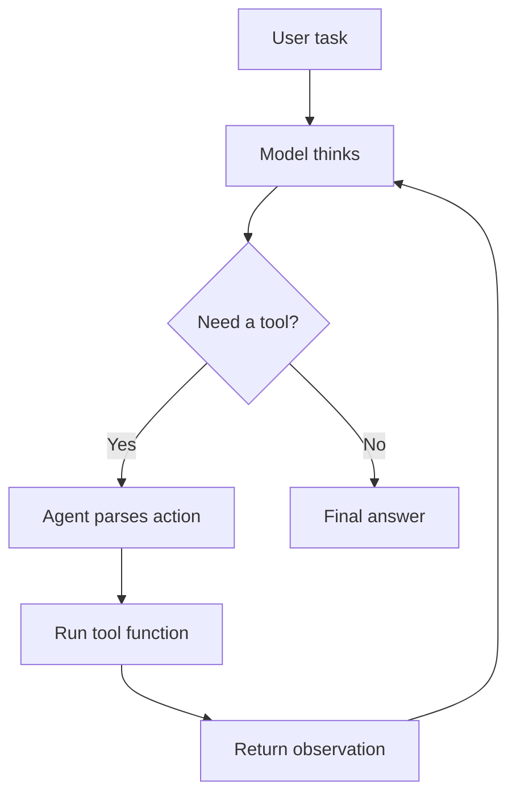

# ReAct Agent Learning Sample

这是一个用于理解 ReAct Agent 运行机制的学习样例。

代码来源于本地学习过程，核心目标不是构建生产级 Agent，而是帮助理解：

- Agent 如何组织模型、工具和主循环
- ReAct 如何通过 `thought/action/observation/final_answer` 推进任务
- 大模型输出工具调用意图后，Agent 框架如何真正执行工具
- 为什么权限控制、用户确认和错误处理应该放在 Agent 框架层

## Files

- `agent.py`：ReAct Agent 主程序
- `prompt_template.py`：系统提示词模板
- `requirements.txt`：运行依赖
- `.env.example`：环境变量示例

## Core Flow



## My Understanding

Agent 可以拆成四层：

- 模型：负责理解任务、推理和生成下一步动作。
- 工具：外部能力，例如读文件、写文件、执行命令。
- 系统提示词：约束模型按指定格式输出。
- Agent 主程序：解析模型输出、调用工具、管理上下文和结束条件。

关键点是：模型本身不会真的调用工具。模型只是输出工具调用意图，真正执行工具的是 Agent 框架。

## Product Notes

从 AI 产品经理视角看，ReAct Agent 的产品设计重点包括：

- 工具命名是否清晰
- 参数是否结构化
- 工具执行前是否需要用户确认
- observation 是否足够短且可行动
- 错误信息是否能帮助模型继续修正
- 高风险动作是否有权限控制和审计

## Run Locally

Install dependencies:

```bash
pip install -r requirements.txt
```

Create `.env`:

```bash
cp .env.example .env
```

Set your OpenRouter API key:

```text
OPENROUTER_API_KEY=your_api_key_here
```

Run:

```bash
python agent.py /path/to/project
```
